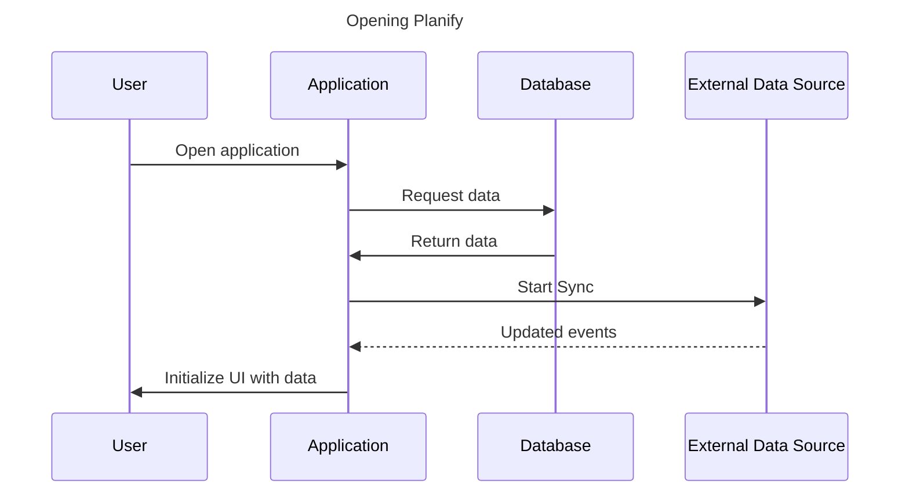
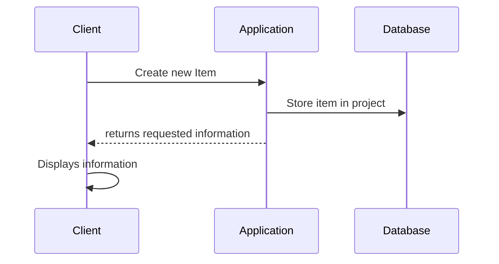
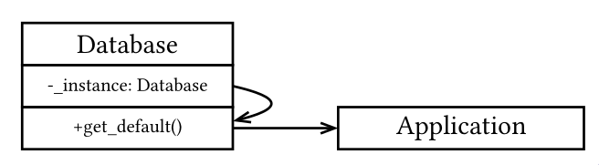
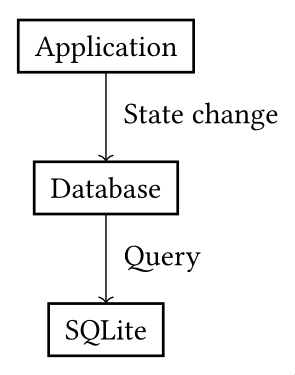
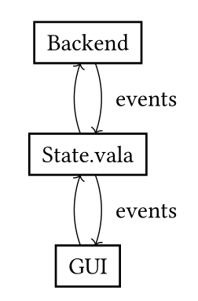
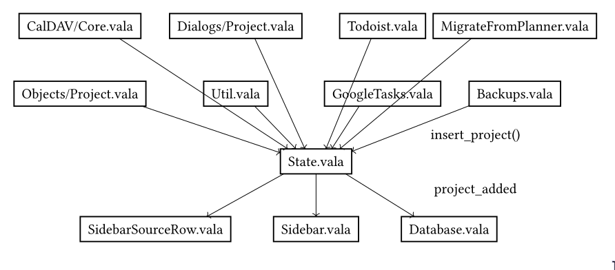
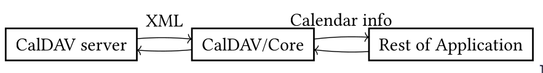
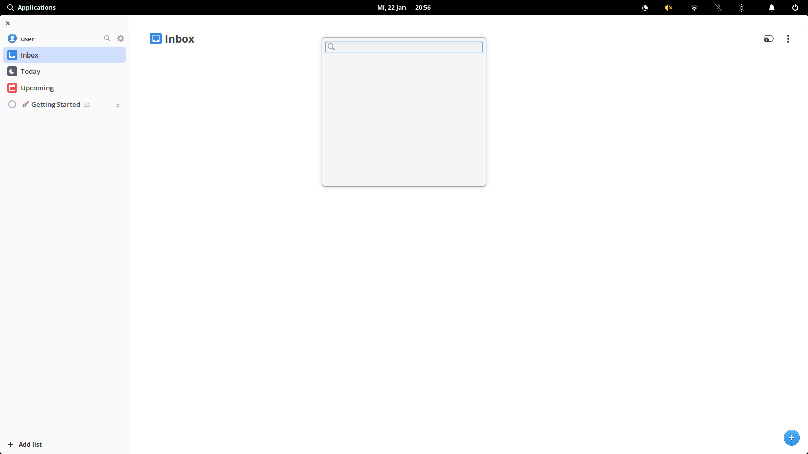
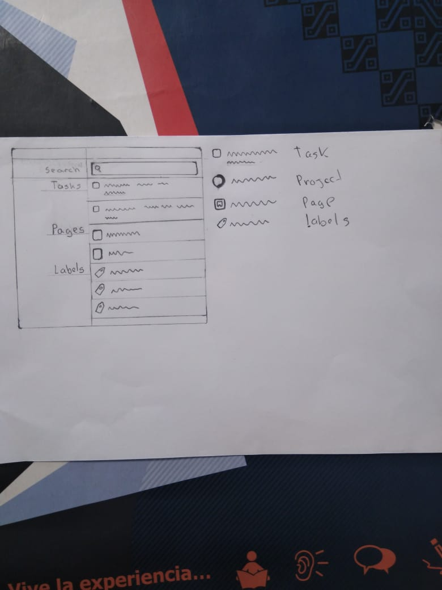
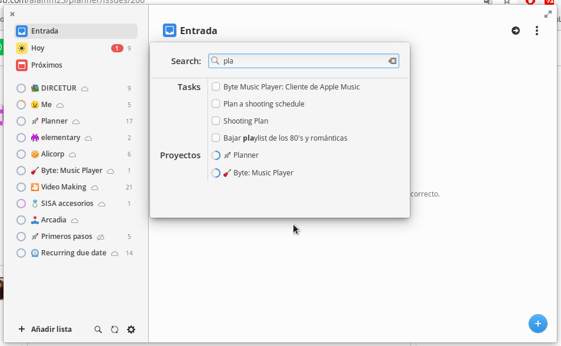

# Design Outline

Planify uses a Model-View-Controller architecture. At a high level, there are two main components to the application: the frontend and the backend. The frontend implements all of the logic for assembling the UI, displaying data, and listening for user interaction using the GTK GUI library. Hence, the frontend consumes the Model and implements the View portion of the architecture. The backend is responsible for the business logic in handling user input, making necessary changes to models, and saving to the database. The backend implements the Controller by making the correct changes to the Models.

The frontend is stored in the src folder, and there are various Views, which contain Layouts composed of Widgets, which are the actual UI components that the user can interact with. The backend is stored in the core folder, and each of the models used by the application are in core/Objects. These objects are sent to the Views, which uses the data to populate the UI. The Controller is implemented in the core/Services/Store.vala file. Views receive data from the Store by subscribing to certain events. When specific models are updated, it will notify the subscribed views with the new object to refresh the UI. When Views receive user interaction events, they will call methods in the Store to handle the user data. The Store will then handle any logic, and store the updated state of the object.  

# Design Details

Database schema: [core/Services/Database.vala](https://github.com/alainm23/planify/blob/4e40a7244c1d2b564e97e65508481f7c2e6ff038/core/Services/Database.vala)  
Class schema: [core/Objects](https://github.com/alainm23/planify/tree/4e40a7244c1d2b564e97e65508481f7c2e6ff038/core/Objects)

## Class Diagram

The class structure is highly intertwined between a few key objects: Item, Project, and Section. For each project, there are multiple sections, with each section having a project variable referring to the project it belongs to. And within those sections, there are multiple items, which is synonymous with tasks. Additionally, each project can contain subprojects, and if a given project is a subproject then it has a parent project. Items can contain subitems, which are partitioned into incomplete items and all items. Each item also contains a project and section object, referring to which objects it belongs to, as well as lists of reminders and attachments. ObjectEvents have DueDate objects for the specific due date of the given object.

## Opening the application

 
When the user opens the application, the App.vala runs MainWindow.vala to initialize the application. First the app starts the Sqlite database and connects to it ([src/MainWindow.vala\#L156](https://github.com/alainm23/planify/blob/master/src/MainWindow.vala#L156)). The database will return the stored data, including any external data sources that the program should synchronize with. Then, the program will start the synchronization process for all connected external data sources ([src/MainWindow.vala\#L198](https://github.com/alainm23/planify/blob/master/src/MainWindow.vala#L198)). The data will be fetched asynchronously. Finally, the UI is populated with the loaded data and displayed to the user.

## Switching pages

The Planify app has three main Views. The label list ([src/Views/Label](https://github.com/alainm23/planify/tree/master/src/Views/Label)), the task list ([src/Views/Project/List.vala](https://github.com/alainm23/planify/blob/master/src/Views/Project/List.vala)), and the day list ([src/Views/Scheduled](https://github.com/alainm23/planify/tree/master/src/Views/Scheduled)). As the user, as you navigate around the application, you can transition between these different states, changing which view is in your main window. By using the Inbox, Today, Scheduled, and Labels buttons in the sidebar, you can transition between those modes, which have specific Views associated with them. For example, if you press the Labels button, that will open a label list view. If you click on a specific label, you will be transitioned to a task list view with all of the tasks with that label attached. From here, you could transition to the day list view by pressing the Scheduled button in the sidebar.

## Adding a new task

From Filter.vala, the function create\_new\_task () is called, which calls the function Services.Store.instance ().get\_project (Services.Settings.get\_default ().settings.get\_string ("local-inbox-project-id")); From this command, the backend will update the database, and then return the updated information to the client to be displayed in the user interface.

## Synchronization

Within MainWindow.vala, it registers a callback that executes a sync every 15 minutes.  
[src/MainWindow.vala\#L196](https://github.com/alainm23/planify/blob/acca39066b3dd02545c693e5c0614655e352d73c/src/MainWindow.vala#L196)

Planify uses an object-oriented composition technique to allow flexibility in the different types of sync services it supports. Within Source.vala, there is a public run\_server method, which calls a private \_run\_server method (encapsulation). This then either calls sync.start for a CalDAV source or Todoist source, depending on the type.  
[core/Objects/Source.vala\#L129](https://github.com/alainm23/planify/blob/acca39066b3dd02545c693e5c0614655e352d73c/core/Objects/Source.vala#L129)

For Todoist sources, it must retrieve a session token from the Todoist API. It makes various other API calls to merges or deletes calendars/tasks as necessary.  
[core/Services/Todoist.vala\#L210](https://github.com/alainm23/planify/blob/4e40a7244c1d2b564e97e65508481f7c2e6ff038/core/Services/Todoist.vala#L210)

For CalDAV Sources, it retrieves the authentication bearer token from storage, authenticates, retrieves & parses the XML, and merges or deletes calendars/tasks as necessary.  
[core/Services/CalDAV/Core.vala\#L234](https://github.com/alainm23/planify/blob/master/core/Services/CalDAV/Core.vala#L234)

SyncButton.vala has the ability to manually trigger a sync by broadcasting on its clicked signal. It also responds to events dispatched from the sources and updates its appearance accordingly when syncs start, fail, or finish.  
[src/Widgets/SyncButton.vala\#L73](https://github.com/alainm23/planify/blob/master/src/Widgets/SyncButton.vala#L73)

## Reminders

When a reminder is created in the UI or loaded from the database at startup, it will run reminder\_added() in Notification.vala ([src/Services/Notification.vala\#L60](https://github.com/alainm23/planify/blob/master/src/Services/Notification.vala#L60)). The code will first check if the time of the notification has already passed, and if it has, it will trigger the notification. If not, it will check whether or not the reminder is due today. If it is due today, it will set a timeout for the remaining time until the notification is due. If it is not due, it will not do anything. However, in TimeMonitor.vala ([src/Services/TimeMonitor.vala](https://github.com/alainm23/planify/blob/master/src/Services/TimeMonitor.vala)), there is always a timeout set for midnight. At midnight, it will call regresh(), causing Notification.vala to rerun reminder\_added() for all reminders. This in effect causes all reminders to check if they are due again, since it is now a new day. This loop continues until all reminders have been triggered.

# Design Patterns

## Singleton

The singleton pattern is ubiquitous in Planify. An example of it in use is for the database object. Planify uses SQLite for the database, and only one connection needs to be maintained to the database. Therefore, the database class implements the Singleton pattern: [core/Services/Database.vala\#L33](https://github.com/alainm23/planify/blob/master/core/Services/Database.vala#L33)

It contains the necessary components of the pattern including a private \`\_instance\` field, and a public \`get\_default\` method returning the instance and creating it if it doesn’t exist.

## Facade

The database class implements the Facade pattern. The purpose of the Facade pattern is to encapsulate complexity behind a simple API, analogous to how the Tardis encapsulates a larger space inside a smaller one. This is what the database class achieves. For example, consider the \`update\_project\` method: [core/Services/Database.vala\#L953](https://github.com/alainm23/planify/blob/master/core/Services/Database.vala#L953)

It has a very simple API: \`database.update\_project(project)\`. Under the hood, it constructs an SQL \`UPDATE\` query, fills in the query variables with the information of the project, and executes the query on the database. Every function in the database works like this and encapsulating the complexity behind a facade prevents the complexity from spilling into the rest of the application.

## Mediator

The purpose of this pattern is to reduce code spaghettification by disallowing direct communication between components and forcing them to communicate through a common mediator. The Store ([core/Services/Store.vala](https://github.com/alainm23/planify/blob/master/core/Services/Store.vala)) singleton mediates communication between UI and backend components through a collection of signals which are Vala’s built-in implementation of events and the Observer pattern. The various UI and backend components, instead of being tied to each other, are tied to the State and then to each other.

Planify appears to fall short of implementing a complete model/view/controller architecture because the UI is not created and updated directly from the state, but is instead updated through event handlers that are triggered at the same time as state updates.

## Observer

The Store singleton also follows the Observer pattern. The Observer pattern is the implementation of a subscriptions system allowing others to listen to messages and to broadcast messages to listeners. This pattern is ubiquitous in UI development and is a language feature built-in to Vala, using the keyword \`signal\`. As mentioned before, the Store singleton contains numerous signals allowing UI and backend components to subscribe to various state changes.

## Adapter

The Adapter pattern allows incompatible APIs to communicate by offering a conversion between them. In Planify, it is necessary to communicate with calendar servers using the CalDAV format. The Planify UI and Backend do not understand the CalDAV protocol, so the protocol is implemented in the CalDAV/Core class ([core/Services/CalDAV/Core.vala](https://github.com/alainm23/planify/blob/master/core/Services/CalDAV/Core.vala)).

The CalDAV/Core class is architectured fairly strangely, but still follows the fundamental idea of the pattern. Each method in the class takes a \`Source\` object, which represents a calendar source. It will then perform the correct HTTP/S requests using the Source to dictate the server URL and protocol provider. In effect, it adapts the HTTP API of the CalDAV server. 

# Design Issues

## Functional

**Title:** Quick-find UI/UX & design language integration (issue [\#206](https://github.com/alainm23/planify/issues/206))

### Description

The current quick-find popup modal isn’t very cohesive with the rest of the design for Planify. What should it look like and what features should it have?  

### Chosen solution

The maintainer chose to stick with the modal and add labels to categories for “tasks”, “pages”, “projects”, and “labels”. There was consideration of centering these labels, but it was decided against because it didn’t look good.

### Alternative solution

Alternatively, the modal could have been ditched in favor of an integrated search bar that shows results in the right pane. Projects stay where they are but ones that don’t match the search criteria become hidden.  
**Benefits:** More consistent with the user flow a user is accustomed to. Click on a project on the left sidebar, and see tasks in the right sidebar  
**Drawbacks:** There isn’t a clearly obvious place to put “labels” and “pages”. Would need to be given a new section in the sidebar, which might make it inconsistent with how the app normally works and be unexpected to users.

The improvement to software is dependant on opinion, but I think it would be better from a consistency perspective

## Non-Functional

**Title:** Usage of CalDAV backend (issue [\#555](https://github.com/alainm23/planify/issues/555) & [\#1149](https://github.com/alainm23/planify/issues/1149))

### Description

Many users use 3rd party CalDav servers (a protocol for exchanging ical format calendar files over HTTP) like NextCloud to store their calendars and tasks. Planify should be able to integrate with those systems to aggregate user’s tasks from various sources. How should Planify gather this data?

### Chosen Solution

The maintainer chose to use [evolution-data-server](https://gitlab.gnome.org/GNOME/evolution-data-server) ([architecture](https://wiki.gnome.org/Apps\(2f\)Evolution\(2f\)EDS_Architecture.html)), an open-source package originally from the evolution mail client that aggregates various calendar/contact sources. However, users are still having issues linking non-NextCloud servers.

### Alternative Solution

Use GNOME’s Online Accounts interface  
**Benefits:** automatically & easily integrate with additional signin methods provided by the GNOME desktop  
**Drawbacks:** tightly couples Planify with the GNOME desktop environment. Users outside of GNOME would not be able to link their CalDav servers

This alternative makes the software worse, and additional alternatives or writing a custom CalDav client would have to be considered.
