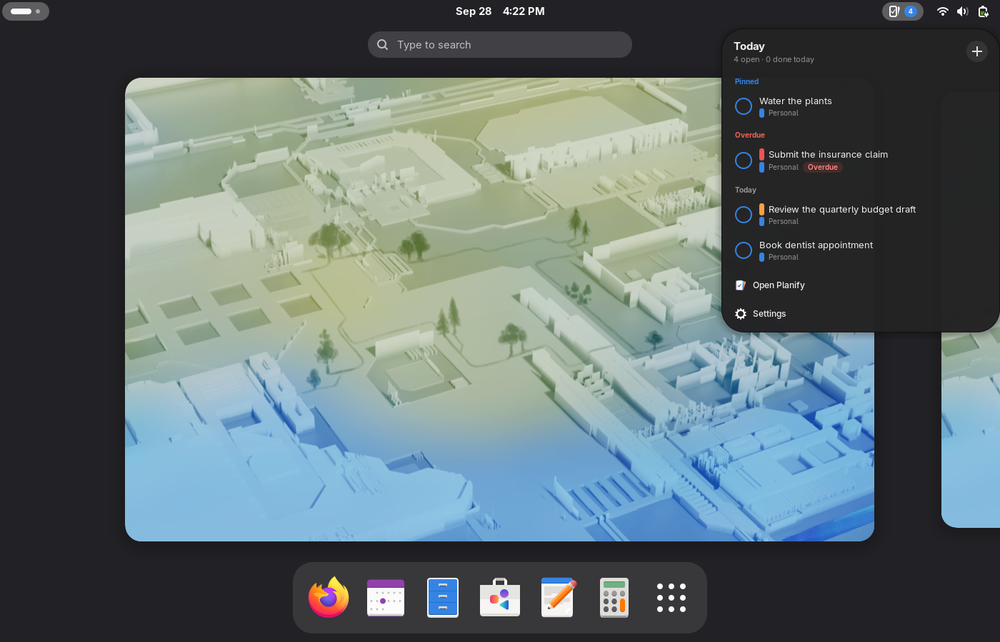
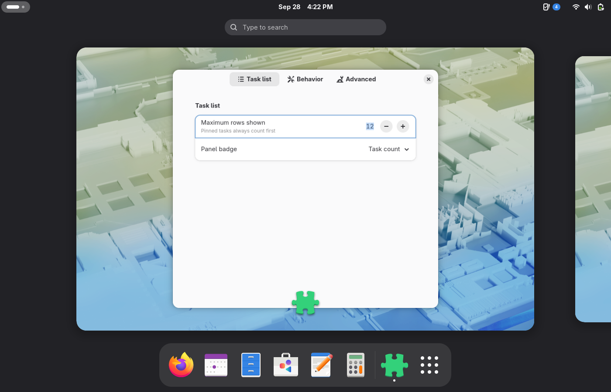

# Planify Quick View — GNOME Shell panel extension

A GNOME Shell extension that puts Planify in your top bar. Clicking the
panel button opens a quick-view card — due-today and overdue tasks, live
from your Planify database — styled like a native GNOME quick-settings
card. Click a task to complete it, click outside or press `Escape` to
dismiss it (it animates back into its panel icon).

```
┌──────────────────────────────┐
│ Today                    [+] │
│ 5 open · 2 done today        │
│ ○ Restart learning Chinese…  │
│   ● Inbox          Overdue   │
│ ○ Help Cathy find job        │
│   ● Inbox             14:00  │
│ …                            │
│ ⬒ Open Planify               │
└──────────────────────────────┘
```

**This is the first GNOME Shell extension for Planify** (verified against
extensions.gnome.org and GitHub in September 2026).

## Screenshots

Popup with Pinned / Overdue / Today sections (fixture data):



Fold-out description with copy button:


Settings window:



## How it works

- The extension runs inside `gnome-shell` (GJS) and renders the card with
  native `St` widgets — a GTK4 app window cannot be embedded in the shell,
  so data moves, not pixels.
- Tasks are read **directly and read-only** from Planify's SQLite database
  (`~/.var/app/io.github.alainm23.planify/data/.../database.db` for the
  Flatpak, `~/.local/share/io.github.alainm23.planify/` for native
  installs) via the `sqlite3` CLI in read-only mode. The extension never
  writes to the database.
- Completing a task is delegated to the Planify app over D-Bus
  (`org.freedesktop.Application.ActivateAction("complete", …)`), so
  recurring tasks advance and Todoist sync stays consistent. If Planify is
  not running, clicking a task opens it in the app instead.
- Live updates via a file monitor on the database plus a low-frequency
  poll (midnight rollover, missed events).
- A global keybinding (default off, e.g. `['<Super><Shift>p']`) can toggle
  the popup.

See [docs/architecture-decision.md](docs/architecture-decision.md) for the
full design rationale (including the Phase-2 in-app D-Bus API plan) and
[docs/research-gnome-shell-extensions.md](docs/research-gnome-shell-extensions.md)
for the research and best-practices base.

## Install (user session)

```bash
./install.sh --enable     # install + enable; live on the next session start
./install.sh --uninstall  # fully remove
./build.sh                # build dist/planify-quick-view.zip for EGO upload
```

`install.sh` uses `gnome-extensions install` so a *running* shell registers
the files; the shell scans new extension directories only at session start,
so the panel button appears after your next login (this is standard GNOME
behavior for local zip installs — extensions.gnome.org installs are the
only ones that load instantly).

Requirements: GNOME Shell 50 (uses the 45+ ESM API; see
`metadata.json shell-version`), the `sqlite3` CLI, and Planify (Flatpak or
native) for data.

## Settings

Everything is configurable in the **Settings window** — click the panel
icon, then the gear row at the bottom of the popup (or `gnome-extensions
prefs planify-quick-view@alainm23.github.io`).

## Settings reference (gsettings)

Schema `org.gnome.shell.extensions.planify-quick-view`:

| Key | Default | Purpose |
|---|---|---|
| `database-path` | `""` | Override the Planify database path (testing) |
| `max-rows` | `12` | Rows shown before the list scrolls |
| `complete-delay-seconds` | `3` | Undo window after clicking a checkbox; click again to cancel. 0 = complete instantly |
| `animation-duration` | `0` | 0 = built-in (220 ms open / 160 ms close) |
| `debug-dbus` | `false` | Expose test D-Bus interface (see below) |
| `toggle-quick-view` | `[]` | Global keybinding to toggle the popup |
| `badge-mode` | `"count"` | Panel badge: `count`, `dot`, or `hidden` |

```bash
gsettings set org.gnome.shell.extensions.planify-quick-view \
  toggle-quick-view "['<Super><Shift>p']"
```

## Testing

```bash
./tests/e2e-nested.sh    # functional suite in an isolated headless shell
./tests/e2e-real.sh      # interactive suite for a graphical session
                         # (real clicks via ydotool, Escape, outside click)
```

The nested suite runs the extension in its own GNOME Shell with its own
D-Bus session and dconf, reads the real Planify database, and verifies the
full state machine and clean teardown. The real-session suite exercises
actual mouse/keyboard input on the real panel button. Details and results:
[docs/testing.md](docs/testing.md).

`debug-dbus` exposes `io.github.alainm23.planify.QuickView` on the session
bus (`Toggle`, `Open`, `Close`, `Status`, `Capture`, `Repaint`) — a test
hook, off by default.

## Scope, known limitations

- **Read-only quick view**: completing tasks works through the app;
  editing/creating happens in Planify (the header **[+]** button opens
  Planify's quick-add window).
- Keyboard navigation between task rows (arrow keys) is not implemented
  yet; `Escape` and outside-click dismissal are handled by the shell.
- "Today" semantics replicate Planify's local-date comparison in SQL;
  recurring tasks are marked (↻) and completing them advances via the app.
- If Planify has never run, the card shows an empty state with an
  **Open Planify** shortcut.

## License

GPL-3.0-or-later, same as Planify. © 2026 Planify contributors.
